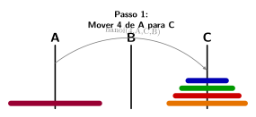
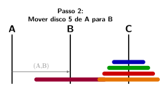

[](https://classroom.github.com/a/ff9hpf9K)
# Tarefa: As Torres de Hanói

## Descrição

As Torres de Hanói é um quebra-cabeça clássico que consiste em três pinos e uma série de discos de tamanhos diferentes, empilhados em ordem decrescente em um pino inicial (o pino de "origem").

O objetivo é mover toda a pilha de discos do pino de origem para um pino de "destino", seguindo estas regras:

1.  Apenas um disco pode ser movido de cada vez.
2.  Um disco nunca pode ser colocado sobre um disco menor que ele.
3.  Um terceiro pino ("auxiliar") pode ser usado para armazenamento temporário.

Nesta tarefa, você implementará uma função em Haskell que resolve o quebra-cabeça, gerando a sequência de movimentos necessários para mover N discos de um pino para outro.

## A Solução Recursiva

O problema das Torres de Hanói tem uma solução recursiva notoriamente elegante. A chave é pensar no problema em termos de mover uma pilha de `n` discos, em vez de discos individuais.

Para mover uma pilha de **n** discos de um pino de **Origem** para um pino de **Destino**, usando um pino **Auxiliar**:

* **Caso Base:** Se `n` for 0, não há nada a fazer. A tarefa está concluída.
* **Caso Recursivo (se `n > 0`):**
    1.  **Mova `n-1` discos da Origem para o pino Auxiliar.**  
        Para fazer isso, ignore o disco maior na base e resolva o mesmo problema para a pilha menor de `n-1` discos. Neste sub-problema, o pino de Destino original se torna o pino auxiliar temporário.
    2.  **Mova o único disco restante (o maior) da Origem para o Destino.**  
        Este é um único movimento e é o passo "real" de trabalho nesta etapa da recursão.
    3.  **Mova os `n-1` discos do pino Auxiliar para o pino de Destino.**  
        Novamente, resolva o mesmo problema para a pilha de `n-1` discos, mas desta vez usando o pino de Origem original como o pino auxiliar temporário.

---

## Ilustração com Imagens

Para visualizar a recursão, imagine que queremos mover 5 discos do pino A para o B, usando o pino C como auxiliar:

1.  **Situação inicial**  
    

1.  **Resolver para n-1 (mover 2 discos de A para C):**  
    

2.  **Mover o disco N (mover o disco 3 de A para B):**  
    

3.  **Resolver para n-1 (mover 2 discos de C para B):**  
    

---

## Funções e Ações a Implementar

Seu trabalho será implementar a lógica recursiva em uma função pura e, em seguida, usar uma ação de E/S para interagir com o usuário.

1.  **`hanoi :: Integer -> Pino -> Pino -> Pino -> [Movimento]`**
    * Esta é a **função pura** principal. Ela recebe o número de discos, e os nomes dos pinos de Origem, Destino e Auxiliar.
    * Ela deve resultar em uma lista de `Movimento`s, que representa a sequência exata de passos para resolver o quebra-cabeça.
    * Use os seguintes sinônimos de tipo no seu módulo:
      ```haskell
      type Pino = String
      type Movimento = (Pino, Pino)
      ```

2.  **`main :: IO ()`**
    * Uma **ação de E/S** que:
        * Solicita ao usuário o número de discos.
        * Chama a função `hanoi` com os pinos "A", "B" e "C".
        * Imprime a lista de movimentos de forma clara e legível (por exemplo, um movimento por linha).

## Exemplo de Execução

```shellsession
Quantos discos? 3
A solução para mover 3 discos de A para B é:
Mova o disco de A para B
Mova o disco de A para C
Mova o disco de B para C
Mova o disco de A para B
Mova o disco de C para A
Mova o disco de C para B
Mova o disco de A para B
````

-----

## Desenvolvimento e Testes

Complete as definições para resolver o problema proposto. O seu projeto deve passar em todos os testes fornecidos.

```shellsession
$ cabal build               # Compila o projeto
$ cabal repl hanoi-solver   # Carrega o projeto no REPL
$ cabal run hanoi-solver    # Executa o programa
$ cabal test                # Executa os testes
```
